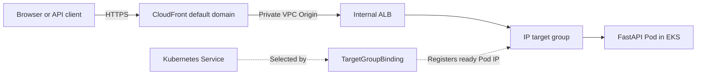

# Kubernetes deployment

This directory keeps one hardened base deployment and small environment-specific overlays.
Kustomize is built into `kubectl`, so application deployment does not require Helm.

```text
deploy/
├── base/
│   ├── config.env
│   ├── deployment.yaml
│   ├── service.yaml
│   └── kustomization.yaml
└── overlays/
    ├── minikube/
    │   ├── kustomization.yaml
    │   ├── namespace.yaml
    │   └── secrets.env.example
    └── eks/
        ├── external-secret.yaml
        ├── kustomization.yaml
        ├── secret-store.yaml
        └── target-group-binding.yaml
```

## Configuration and secrets

Non-sensitive settings live in the tracked `base/config.env` file. Kustomize generates a
versioned ConfigMap from that file and merges environment-specific overrides from each
overlay.

The Minikube overlay generates `ai-agent-sample-secrets` from an untracked `secrets.env`
file with these keys:

- `DP_API_KEY`
- `API_BEARER_TOKEN`

Create the local secret source from the tracked example before rendering or applying an
overlay:

```bash
cp deploy/overlays/minikube/secrets.env.example \
  deploy/overlays/minikube/secrets.env
# Replace the placeholder values in secrets.env before applying the overlay.
```

The real `secrets.env` file is ignored by Git.

The EKS overlay never reads a local secret file. Terraform creates a Secrets Manager secret,
installs External Secrets Operator, and gives the operator least-privilege access through EKS
Pod Identity. `secret-store.yaml` and `external-secret.yaml` synchronize the two JSON
properties into the Kubernetes Secret expected by the Deployment.

## Minikube

Build the image on the host, load it into Minikube, and apply the local overlay:

```bash
docker build -t ai-agent-sample:local-20260825 .
minikube image load ai-agent-sample:local-20260825
kubectl apply -k deploy/overlays/minikube
kubectl rollout status deployment/ai-agent-sample --namespace=ai-agent-sample
kubectl port-forward service/ai-agent-sample 8000:8000 --namespace=ai-agent-sample
```

The Minikube overlay enables allowlisted command execution for local experimentation. The
base and EKS overlay leave it disabled by default.

## EKS

Apply the companion Terraform project first. It creates the application namespace, ECR
repository, Secrets Manager secret, AWS Load Balancer Controller, External Secrets Operator,
internal ALB, target group, CloudFront VPC Origin, and CloudFront distribution.



`target-group-binding.yaml` is the control-plane bridge between Kubernetes and the existing target
group. AWS Load Balancer Controller watches it and registers the Service's ready Pod IP. It does
not create a second ALB.

Add a secret value shaped like this outside the repository:

```json
{
  "DP_API_KEY": "replace-with-your-deepseek-api-key",
  "API_BEARER_TOKEN": "replace-with-a-long-random-token"
}
```

The default remote secret name is `eks-workshop/dev/ai-agent-sample`. If you change the
Terraform cluster, environment, or application names, update both `remoteRef.key` values in
`external-secret.yaml`.

Build and push an image to ECR, then update `newName` and `newTag` in
`overlays/eks/kustomization.yaml` before deploying manually:

```bash
kubectl diff -k deploy/overlays/eks
kubectl apply -k deploy/overlays/eks
kubectl wait externalsecret/ai-agent-sample-secrets \
  --for=condition=Ready --timeout=120s --namespace=ai-agent-sample
kubectl rollout status deployment/ai-agent-sample --namespace=ai-agent-sample
kubectl get targetgroupbinding ai-agent-sample --namespace=ai-agent-sample
```

The default binding expects the Terraform target group `ai-agent-sample-dev-tg`. To verify the
complete route rather than only Kubernetes rollout health:

```bash
TARGET_GROUP_ARN=$(aws elbv2 describe-target-groups \
  --names ai-agent-sample-dev-tg \
  --region ap-northeast-1 \
  --query 'TargetGroups[0].TargetGroupArn' \
  --output text)

aws elbv2 wait target-in-service \
  --target-group-arn "$TARGET_GROUP_ARN" \
  --region ap-northeast-1

terraform -chdir=/path/to/aws-eks-paltform-sample/infrastructure/environments/dev \
  output -raw application_url
```

### Automated ECR publishing

The workflow in `.github/workflows/ci-cd.yml` runs linting and tests for pull requests. On a
push to `main`, or a manual run from `main`, it then performs these jobs in order:

1. `Build and push an image to ECR` obtains short-lived AWS credentials with GitHub OIDC,
   logs in to ECR, and uses Docker Buildx to build and push a `linux/amd64` image.
2. `Deploy the published image to EKS` consumes the exact image URI produced by the publish
   job, applies the EKS overlay, verifies secret synchronization and rollout health, and waits
   until the ALB reports the registered Pod target as healthy.

The Terraform ECR repository uses immutable tags. Every workflow run therefore creates a
unique, traceable tag in this form:

```text
sha-<12-character-commit>-<workflow-run-id>-<attempt>
```

The workflow prints both the image URI and its content digest in the GitHub Actions job
summary. BuildKit layers are cached in GitHub Actions to make subsequent builds faster.

Before the first run, enable the Terraform-managed GitHub OIDC role with this exact branch
subject and apply the Terraform project again:

```hcl
github_actions_oidc_subject = "repo:GodfreyLyu/AiAgentSample:ref:refs/heads/main"
```

Then create the `AWS_DEPLOY_ROLE_ARN` Actions repository variable in
**Settings → Secrets and variables → Actions → Variables**. Its value is returned by:

```bash
terraform -chdir=infrastructure/environments/dev output -raw github_actions_deploy_role_arn
```

No long-lived AWS access key is stored in GitHub. `AWS_REGION`, `ECR_REPOSITORY`,
`EKS_CLUSTER_NAME`, `KUBERNETES_NAMESPACE`, and `TARGET_GROUP_NAME` are declared at the top of the
workflow and must remain aligned with the Terraform environment.

The Terraform project maps the GitHub IAM role to a Kubernetes group and binds that group to one
namespace-scoped Role. The Role covers only ConfigMaps, Services, Deployments, `ExternalSecret`,
`SecretStore`, and `TargetGroupBinding`, with no delete verb and no permission to read Kubernetes
Secrets. The workflow checks all of these permissions before applying manifests and reports a
targeted configuration error if the Terraform RBAC has not been applied. It does not require or
receive cluster-admin access.

The public endpoint is the default CloudFront HTTPS domain. The ALB is internal, and its port 80 is
restricted to the AWS-managed CloudFront origin-facing prefix list. CloudFront-to-ALB traffic uses
HTTP inside the private VPC Origin path. The Terraform README explains the additional private DNS,
certificate, listener, and origin changes required if organizational policy requires encryption
on every hop. CloudFront caching is disabled for this authenticated API, and VPC Origins do not
support WebSockets or gRPC.

The application currently stores sessions and workspaces inside one Pod, so the Deployment
intentionally runs one replica. Add a shared session backend and persistent workspace design
before scaling horizontally.

## Inspect the rendered manifests

Render either target before applying it. The Minikube output contains base64-encoded Secret
data, so inspect that output only in a trusted terminal and never commit or publish it:

```bash
kubectl kustomize deploy/overlays/minikube
kubectl kustomize deploy/overlays/eks
```
